# 🔐 Full-Stack Auth with Passport.js & React

A modern, production-ready starter template showcasing full-stack user authentication. It features Local Registration/Login (with password hashing) and Google OAuth 2.0 Sign-In using Passport.js, backed by a persistent MongoDB session store.

---

## 🏗 Tech Stack


---

## ✨ Features

- **Double Strategy Auth**: Local strategy (email & password using `bcrypt` hashing) + Google OAuth 2.0.
- **Session-Based Authentication**: Managed via `express-session` and Passport serialization for seamless cookie-based persistence.
- **React-Router Protection**: Frontend route protection to shield components from unauthorized access.
- **Backend Protection**: Custom middleware to secure Express API endpoints.
- **Polished Frontend UI**: Built with React (TypeScript), Tailwind CSS, Lucide icons, Framer Motion animations, and a seamless Dark/Light mode theme system.

---

## 📁 Project Directory Structure

```text
auth_with_passportjs/
├── backend/
│   ├── index.ts               # Express application entrypoint & API endpoints
│   ├── middlewares/
│   │   └── auth.ts            # Authenticated route middleware
│   ├── services/
│   │   ├── database.ts        # Mongoose connection & User model schema
│   │   └── passport.ts        # Passport Local & Google Strategy configuration
│   ├── tsconfig.json
│   ├── package.json
│   └── .env.example
├── frontend/
│   ├── src/
│   │   ├── App.tsx            # Main layout and client routing
│   │   ├── main.tsx           # React entry point
│   │   ├── components/
│   │   │   ├── AuthContext.tsx    # Global Authentication React context provider
│   │   │   ├── theme-provider.tsx # Theme context provider
│   │   │   └── theme-toggle.tsx   # Light/Dark mode toggler
│   │   ├── pages/
│   │   │   ├── home.tsx       # Auth portal (Register / Login / Google OAuth buttons)
│   │   │   └── dashboard.tsx  # Protected workspace dashboard
│   │   └── index.css          # CSS styles (Tailwind directives)
│   ├── vite.config.ts
│   ├── package.json
│   └── .env.example
└── README.md
```

---

## ⚙️ Quick Start

### 1️⃣ Google Cloud Console Configuration

To enable Google Sign-in:
1. Go to the [Google Cloud Console](https://console.cloud.google.com/).
2. Create or select a project.
3. Navigate to **APIs & Services > Credentials**.
4. Configure the **OAuth consent screen** (set User Type to External).
5. Click **Create Credentials** and select **OAuth client ID**.
6. Set the application type to **Web application**.
7. Under **Authorized redirect URIs**, add:
   ```text
   http://localhost:3000/auth/google/callback
   ```
8. Save and copy your client credentials:
   - `GOOGLE_CLIENT_ID`
   - `GOOGLE_CLIENT_SECRET`

---

### 2️⃣ Environment Variables (`.env`)

Create `.env` configuration files in both `backend/` and `frontend/` folders.

#### Backend Configuration (`backend/.env`)
```env
PORT=3000
MONGO_URI=mongodb://localhost:27017/auth_with_passportjs
SESSION_SECRET=your-session-secret-key-here
GOOGLE_CLIENT_ID=your_google_client_id_here
GOOGLE_CLIENT_SECRET=your_google_client_secret_here
FRONTEND_URL=http://localhost:3001
```

#### Frontend Configuration (`frontend/.env`)
```env
VITE_API_URL=http://localhost:3000
```

---

### 3️⃣ Installation

Run the commands below to pull dependencies for both layers.

```bash
# Install backend dependencies
cd backend
npm install

# Install frontend dependencies
cd ../frontend
npm install
```

---

### 4️⃣ Execution

Run both development environments concurrently.

```bash
# Start backend server (starts on http://localhost:3000)
cd backend
npm run dev

# Start frontend application (starts on http://localhost:3001)
cd ../frontend
npm run dev
```

---

## 🔄 Authentication Architecture & Flow

The authentication architecture relies on stateful cookies. Instead of sending JWTs headers on every call, authentication uses cookie-based passport sessions.

```mermaid
sequenceDiagram
    autonumber
    actor User
    participant FE as React Frontend
    participant BE as Express Backend
    participant Google as Google OAuth API
    participant DB as MongoDB

    %% Registration / Local Auth
    rect rgb(30, 41, 59)
        note right of User: Local Email/Password Registration
        User->>FE: Fills register form
        FE->>BE: POST /register (Name, Email, Password)
        BE->>DB: Check if user exists & hash password
        DB-->>BE: Saved user document
        BE-->>FE: HTTP 201 (User created)
    end

    %% Google Auth Flow
    rect rgb(15, 23, 42)
        note right of User: Google OAuth 2.0 Authentication
        User->>FE: Clicks "Continue with Google"
        FE->>BE: GET /auth/google
        BE-->>FE: Redirects user to Google OAuth Concent Screen
        FE->>Google: Redirect
        Google->>User: Renders sign-in popup
        User->>Google: Selects Google account
        Google->>BE: Callback with OAuth Code (GET /auth/google/callback)
        BE->>Google: Exchanges code for Profile & Tokens
        Google-->>BE: Returns Profile (Id, Name, Email)
        BE->>DB: Upserts Google user profile
        DB-->>BE: User record
        BE->>BE: Initializes passport session & serializes userId
        BE-->>FE: Redirects back to Frontend (FRONTEND_URL)
    end

    %% Session Validation
    rect rgb(30, 41, 59)
        note right of User: App Load / Session Verification
        FE->>BE: GET /me (Credentials: include)
        BE->>BE: Reads Session Cookie & Deserializes User
        BE->>DB: Look up User by serialized ID
        DB-->>BE: User document
        BE-->>FE: HTTP 200 (id, name, email)
        FE->>FE: Sets User state in Context & grants access to Dashboard
    end
```



---

## 🔒 Securing Endpoints

### Backend Protected Routes
Wrap route definitions with `ensureAuthenticated` middleware to block unauthorized requests:
```typescript
import { ensureAuthenticated } from '@/middlewares/auth';

app.get('/me', ensureAuthenticated, (req, res) => {
    res.json(req.user);
});
```

### Frontend Protected Routes
On the client application, route protection checks `user` and `loading` status from `useAuth()` to dynamically redirect guests away from internal routes:
```tsx
const ProtectedRoute = ({ children }) => {
    const { user, loading } = useAuth();
    if (loading) return <div>Loading...</div>;
    return user ? children : <Navigate to="/" />;
};
```
